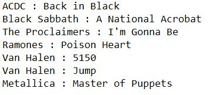

# Mixtape Creator

Application built using Python 3.8

Application entry point is "MixtapeCreatorGUI.py"

The application downloads a list of songs from YouTube to a new directory on your local machine. The list of songs must be stored in a text file, where each line in the file indicates the artist and the song name. This is passed as an input argument, along with the name of a new directory (the mixtape title) and its path. The application outputs this new directory containing the list of songs as mp3 files. Songs that failed to download are written to a separate text file entitled “Unsuccessful_Downloads.txt” in the directory itself. A GUI has been created to make these steps intuitive for users.

## Table of Contents

1. [The Purpose of the Project](#the-purpose-of-the-project) 
2. [Application Demo](#application-demo)
3. [Additional Python Libraries and Packages Required](#additional-python-libraries-and-packages-required)
4. [Formatting the List of Songs File](#formatting-the-list-of-songs-file)

## The Purpose of the Project

The purpose of this project is to enable quick downloads of a list of songs so they can be accessed offline. These songs are organized into a directory with any valid name/path specified on your local machine, making them easily accessible. It is particularly useful when preparing for road trips and air travel. An advantage of utilizing this application over a streaming service such as Spotify is that you can even download audio recordings of live performances that are available on YouTube. This can be accomplished by adding the keyword “Live” after the song name. 

## Application Demo

Click here to view a demo of the application

## Additional Python Libraries and Packages Required
 
* pillow (8.0.1)
* pytube (10.0.0)
* numpy (1.19.3)
* moviepy (1.0.3)

<em>Please install all of these libraries/packages prior to running the application</em>

## Formatting the List of Songs File

Each line of the file containing the list of songs must be in the format “artist_name : song_name”. The following image shows an example of a valid list of songs:

<kbd>
  
</kbd>

